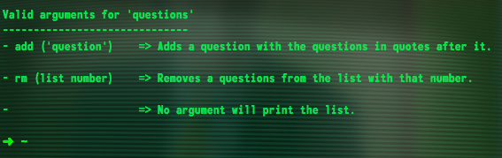
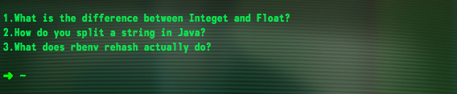
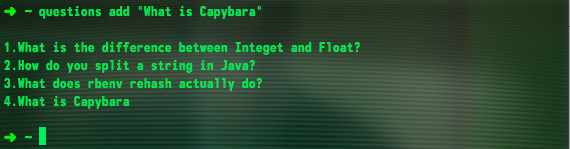
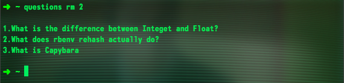

# Questions-App

Questions-App allows for quick simple note taking while in the command line. Can hold many questions, be used from any directory, and can remove previous entries.

## Using the App

The app comes documented in the code and running questions help will list off all the legal commands recognized.

Just running the program with no arguments will print out all of your questions.

Now adding for adding a question you append ' add "_String_" ' to the end of the 'questions' command. You must wrap the question in quotes in order add the question.

For removal of a question you use the rm augment with the list number of what you want to remove. After removal the list will shift up to fill the empty index.

